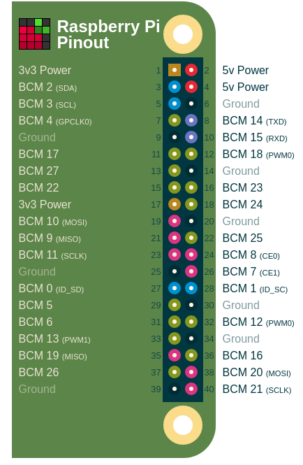
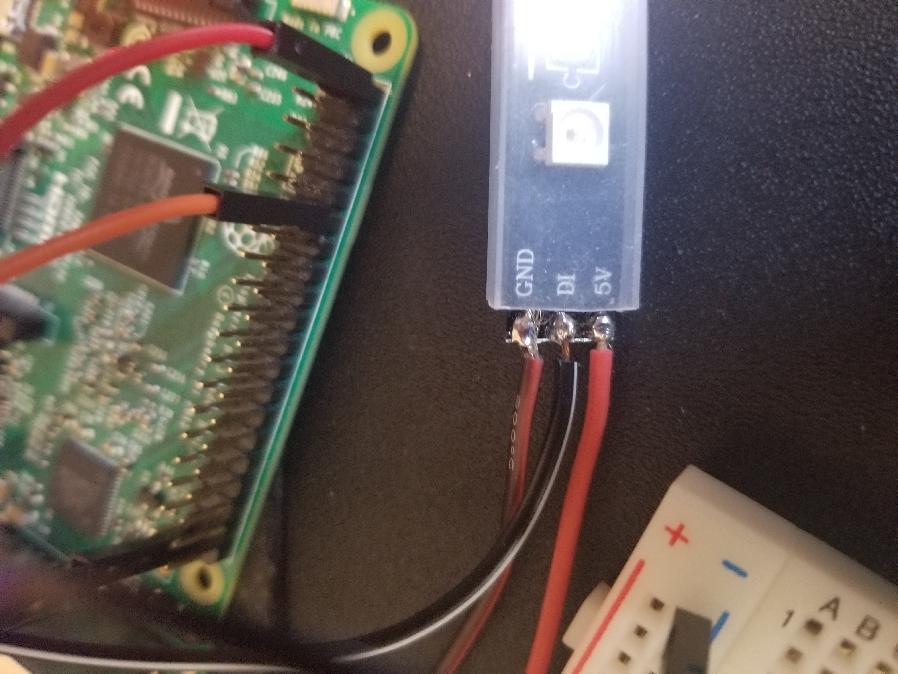

LED Strip Wiring
================

There will be 3 "sensor pis", and each will have an LED strip that it controls. Repeat this process for each "sensor pi".

For reference, here is the pintout of the Raspberry Pi:

And here is the wiring on the LED strips

#. Wire the GND and 5V wires to a 5V power supply (for testing we used 5V and GND pins on the Raspberry Pi, but this seems to
   be generally not recommended as the Pi may struggle to supply it properly).
#. Wire the DI (Data In) wire to pin 12 (BCM 18). This is the Pulse Width Modulation pin, and it allows a digital pin to simulate
   analog output.

This should be all the wiring that is required for the LED strips.