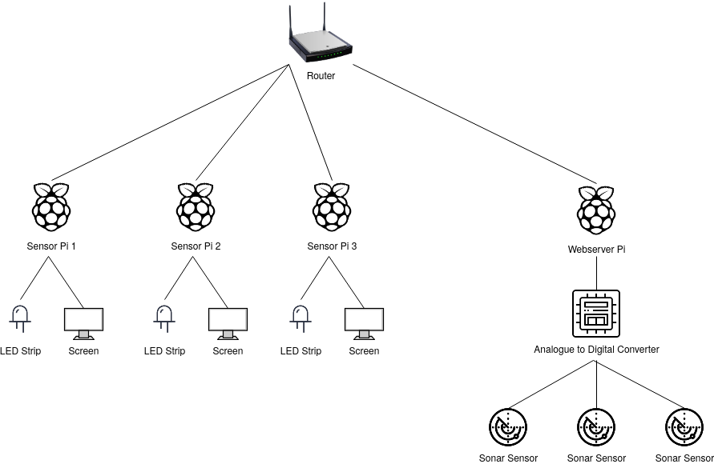

Hardware Overview
=================

This is the high-level structure of the vending machine hardware. The
router is used to allow wireless access to the vending machine. The
Webserver Pi stores the stimuli, experiment, and log files and handles
all the logic of running experiments. Attached to this Webserver Pi is
an analogue to digital converter which translates the information from
the three sonar sensors into a format the Pi can read. These sensors are
used to determine what selection the elephant has made.

The other three Raspberry Pis are used to interface with the additional
hardware. Each Sensor Pi has an LED strip and a screen. The LED strip is
used to provide visual feedback to the elephant about whether or not the
selection it made was correct as determined by the experiment file. The
screens are used to display stimuli to the elephant.

Parts List
##########

+-------------------------------+----------------------------------+----------+
| Component                     |  Model                           | Quantity |
+===============================+==================================+==========+
| Router                        | TP-Link Archer C1200             | 1        |
+-------------------------------+----------------------------------+----------+
| Raspberry Pi                  | Raspberry Pi 3 B                 | 4        |
+-------------------------------+----------------------------------+----------+
| Analogue-to-Digital Converter | Pololu Micro Maestro 6-Channel   | 1        |
|                               | USB Servo Controller             |          |
+-------------------------------+----------------------------------+----------+
| Sonar Sensor                  | MaxBotix MB1330 XL-MaxSonar-AE3  | 3        |
+-------------------------------+----------------------------------+----------+
| Led Strip                     | WS281X RGB LED Strip             | 3        |
+-------------------------------+----------------------------------+----------+
| Monitor                       | Unknown                          | 3        |
+-------------------------------+----------------------------------+----------+