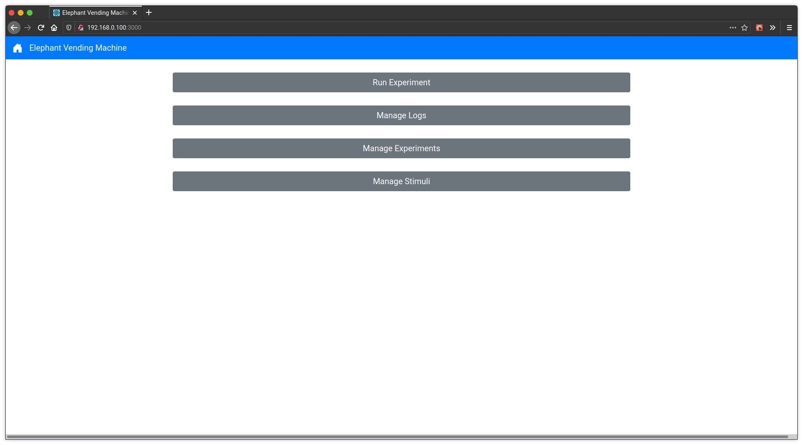
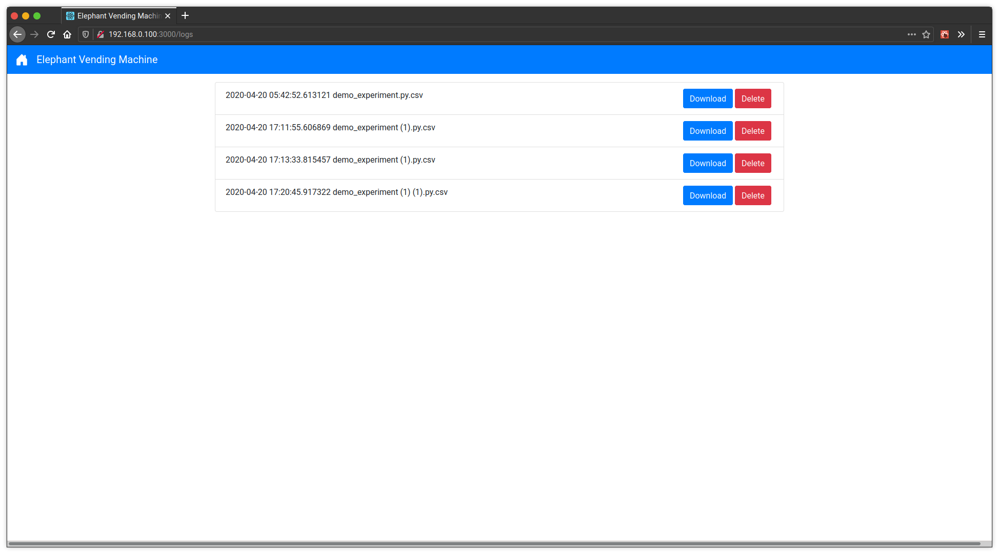
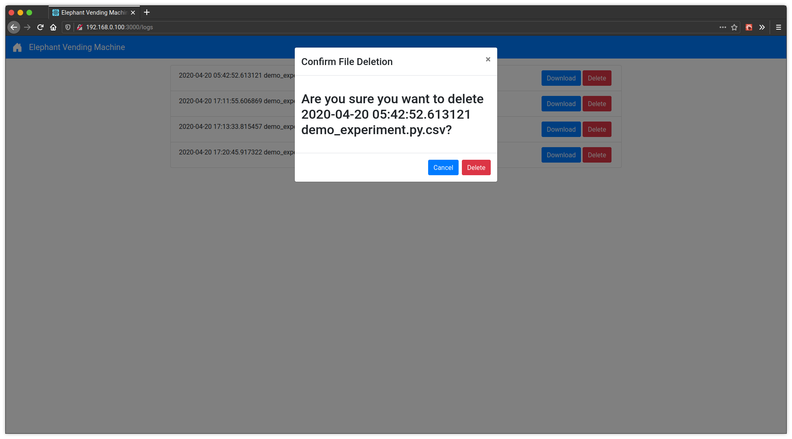
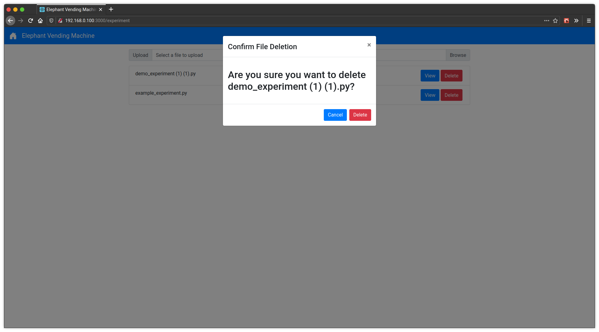
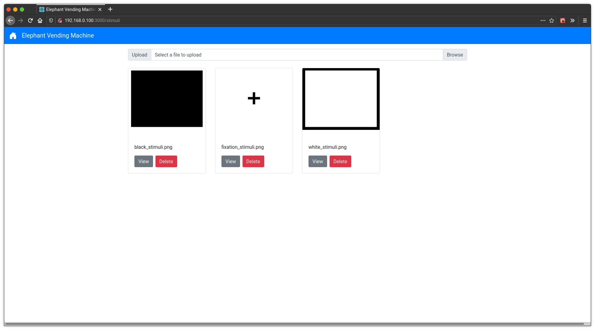
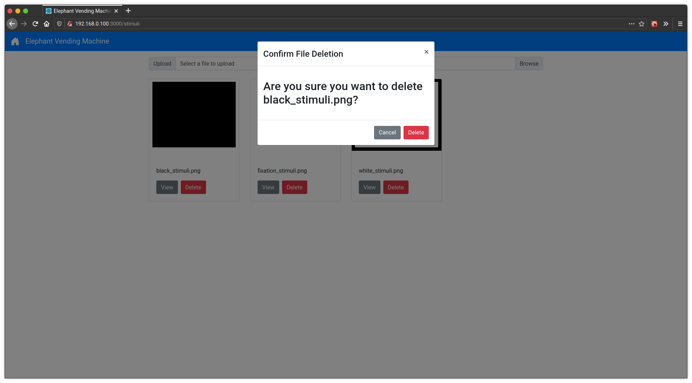

Managing Files
==============
This is the home page of the Elephant Vending Machine. This is the page you will see when you first connect.
From here you can select various pages for managing log, experiment, and stimuli files as well as for starting
experiment files.

Managing Logs
#############
From the home page, select "Manage Logs" and you will see the following log file management page.

On this log management page, you can select the "View" button for any of the log files to download that file.
You can also select "Delete" and then confirm in the popup by selecting "Delete" again to delete a log file.

Managing Experiments
####################
From the home page, select "Manage Experiments" and you will see the following experiment file management page.

.. image:: ../_static/images/experiment_overview.png
  :width: 800
  :alt: Vending Machine Experiment Management page

On this experiment management page, you can select the "View" button for any of the experiment files to download that file.
You can also select "Delete" and then confirm in the popup by selecting "Delete" again to delete an experiment file.

Managing Stimuli
################
From the home page, select "Manage Stimuli" and you will see the following stimuli file management page.

On this stimuli management page, you can select the "View" button for any of the stimuli files to download that file.
You can also select "Delete" and then confirm in the popup by selecting "Delete" again to delete a stimuli file.

