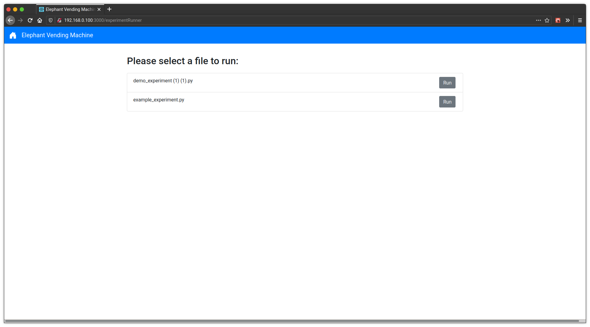
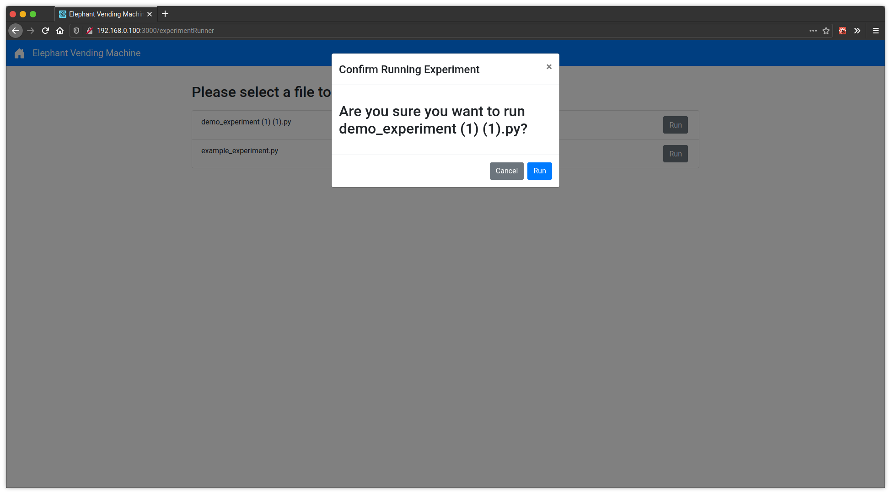

Running Experiments
===================
From the home page, select "Run Experiment" and you will see the following experiment running page.
As a reference, the experiment logger and vending machine helper documentation can be found in the
:ref:`modindex`.

On this experiment running page, you can select the "Run" button for any of the experiment files and
then confirm in the popup by selecting "Run" again to begin running an experiment file.

